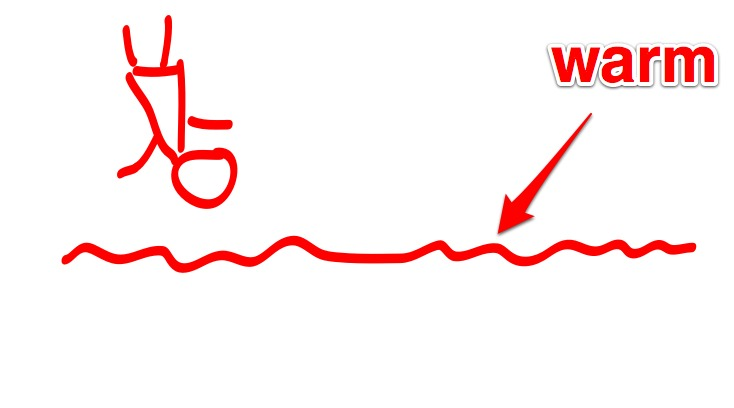

<!SLIDE>

<!SLIDE>

# Fallacies of Distributed Computing

<!SLIDE bullets>

# Irrtümer ...

* Netzwerk ist ausfallsicher
* Latenzzeit ist gleich Null
* Datendurchsatz ist unendlich
* Netzwerk ist sicher
* Topologie ändert sich nicht
* Ein Administrator
* Datentransport ist kostenlos
* Netzwerk ist homogen 

.notes Darin erkennt sich doch jeder wieder, oder?!

