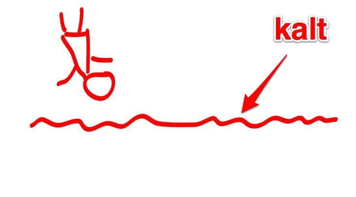
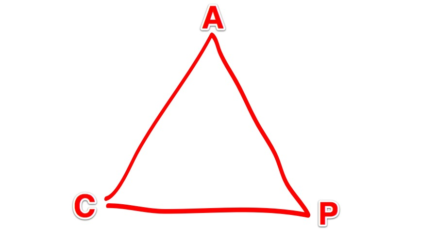
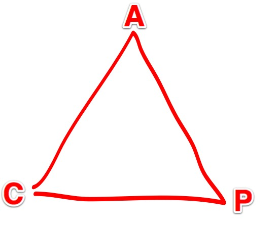

<!SLIDE>

<!SLIDE>

# CAP Theorem

<!SLIDE>

## WTF?

<!SLIDE bullets incremental float-img>

# CAP Theorem
## aka "Brewer's theorem"

* Consistency
* Availability
* Partition Tolerance

.notes Hilft beim Entscheiden was wichtig für die jeweilige Anwendung ist
 // CAP ist seit CLoud ein größeres Thema wurde bekannter geworden // 
 Cloud ermöglicht halt nunmal günstig verteilte Systeme aufzubauen

<!SLIDE bullets cap float-img>

# CAP Theorem
## Wähle Zwei

* Consistency
* Availability
* Partition Tolerance

