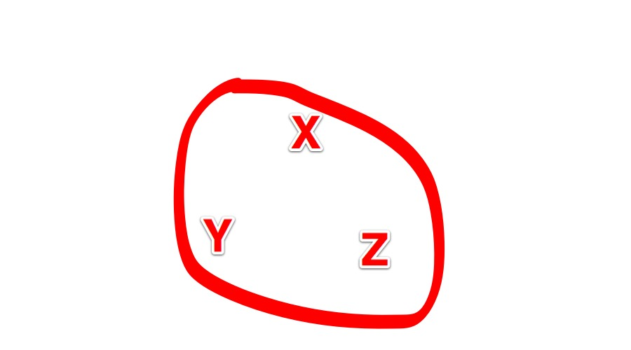
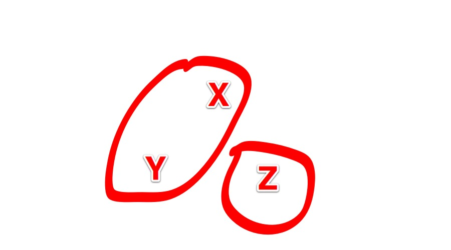
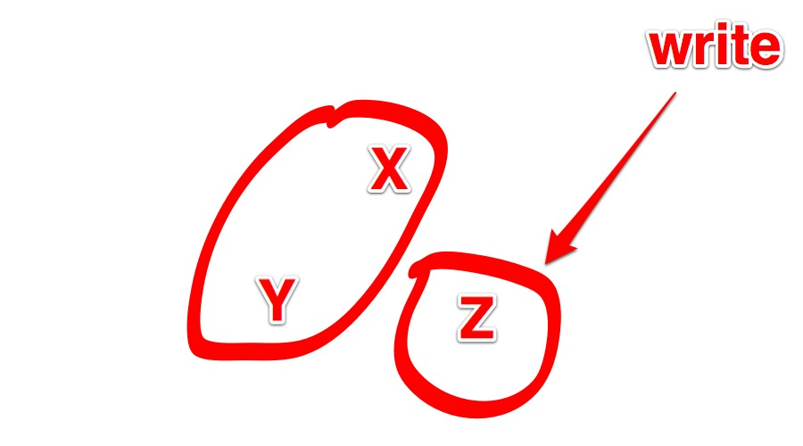

<!SLIDE>

# Immer noch:
## WTF?

<!SLIDE>

# CAP: Beispiel

<!SLIDE>

# CAP: Beispiel

<!SLIDE>

# CAP: Beispiel

.notes Either Consistency or Availability ... you can't sacrifice partition tolerance
.notes Think x, y, z are databases

