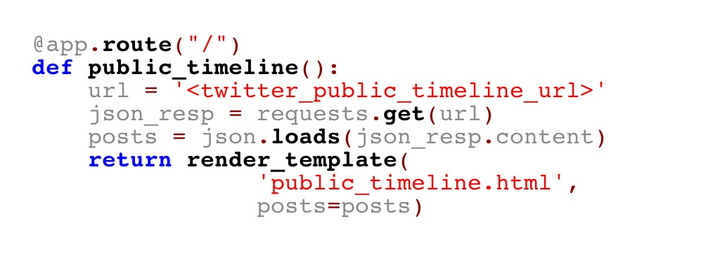
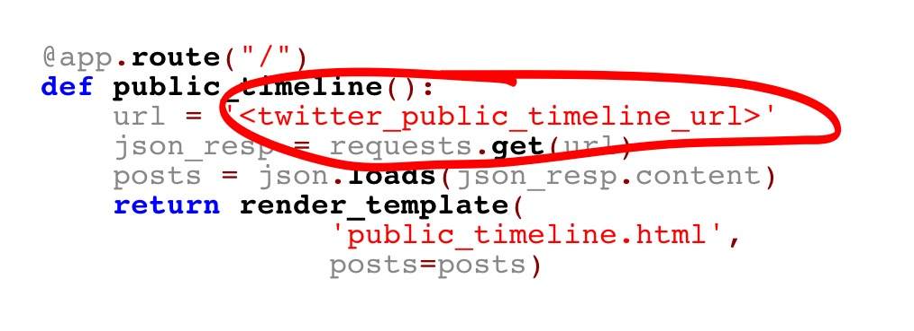
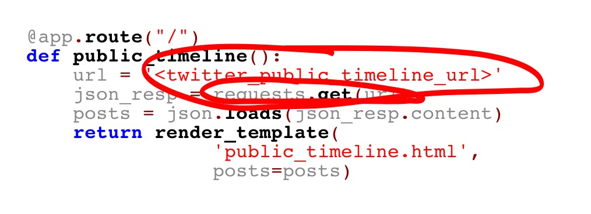
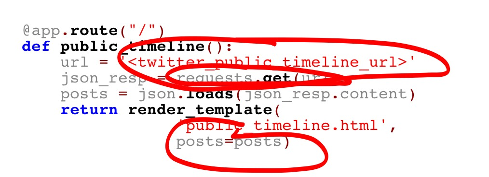

<!SLIDE code code-small>

# Wdh.

    @@@ python
    @app.route("/")
    def public_timeline():
        url = '<twitter_public_timeline_url>' 
        json_resp = requests.get(url)
        posts = json.loads(json_resp.content)
        return render_template(
                    'public_timeline.html', 
                    posts=posts)

<!SLIDE bullets incremental>

# Lösung
## Ursache vs. Symptom

* Bisherige Probleme sind eigentlich nur Symptome

<!SLIDE bullets incremental>

# Lösung
## Ursache: Kopplung!

<!SLIDE bullets incremental>

# Lösung
## Ursache: Kopplung!

<!SLIDE bullets incremental>

# Lösung
## Ursache: Kopplung!

<!SLIDE bullets incremental>

# Lösung
## Ursache: Kopplung!

