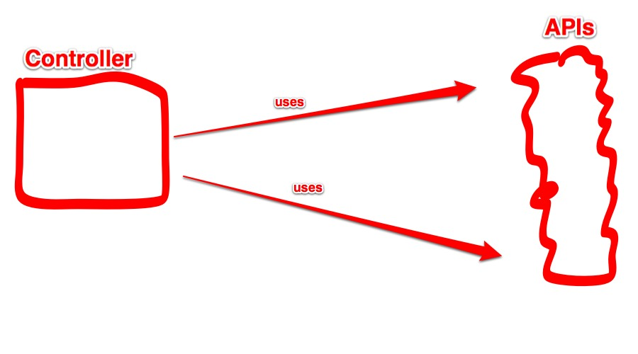
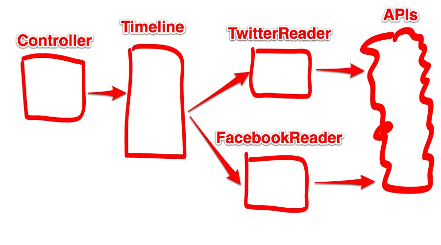

<!SLIDE>

# Lösung
## Vorher

<!SLIDE>

# Lösung
## Nachher

<!SLIDE code code-small>

# Lösung 1/3

    @@@ python
    @app.route("/")
    def public_timeline():
      posts = Timeline().get_public_entries()
      return render_template(
          'public_timeline.html', 
          posts=posts)

.notes Gewisse Aspekte sind zugunsten der Lesbarkeit weggelassen: Timeouts, Async, Caching
  // Decoupling noch nicht optimal aber schon recht weit

<!SLIDE code code-small>

# Lösung 2/3
    @@@ python
    class Timeline:

      def __init__(self, impl=None):
        if impl is None:
          self.impl = TwitterReader()
        else:
          self.impl = impl

      def get_public_entries(self):
        return self.impl.get_public_timeline()

<!SLIDE code code-small>

# Lösung 3/3
    @@@ python
    class TwitterReader:

      def get_public_timeline(self):
        url = 'https://twitter.com/statuses/public_timeline.json' 
        json_resp = requests.get(url)
        return json.loads(json_resp.content)
        
.notes Und das beste daran? Ich krieg Framework-unabhängige Testbarkeit nahezu geschenkt indem
  meine relevante Logik in normalen Objekten steckt, die keine direkte Abhängigkeit zum Framework haben

