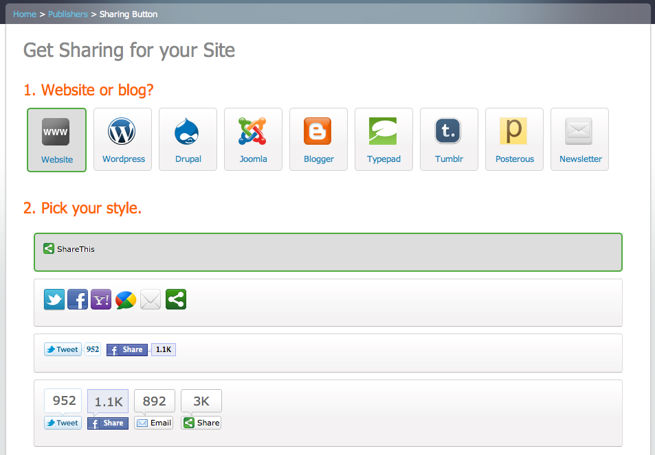

<!SLIDE>

# Poll: 
## Wer hat schonmal Soziale Netzwerke integriert?

.notes hat jemand von euch schonmal ein soziales Netz in seine webapp integriert?

<!SLIDE>

## ... oder doch nur das?

.notes ok, wer davon hat mehr als nur den like Button integriert?

<!SLIDE>

## ... oder doch nur das?

<!SLIDE>

## ... und wer hat dabei folgenden Code geschrieben?

<!SLIDE code code-small>

## ... oder solchen?

    @@@php
    function lists_list_tweets_page($user, $list) {
      // Show tweets in a list
      $tweets = twitter_lists_tweets($user, $list);
      $tl = twitter_std_timeline($tweets, 'user');
      $cont = theme('status_form');
      $list_url = "lists/{$user}/{$list}";
      $cont .= "
Tweets <a href='user/{$user}'>";
      $cont .= "@{$user}</a>/<strong>{$list}";
      $cont .= "</strong> | theme('timeline', $tl);
      theme('page', 
          "List {$user}/{$list}", 
          $content);
    }
    
__http://code.google.com/p/dabr/__

<!SLIDE bullets incremental>

# Merke!

* Integration FB & Co weit verbreitet
* Qualität der Integration ist __naiv__ <strike>mäßig</strike>

.notes Was schließen wir aus dieser un-wissenschaftlichen Herleitung?

